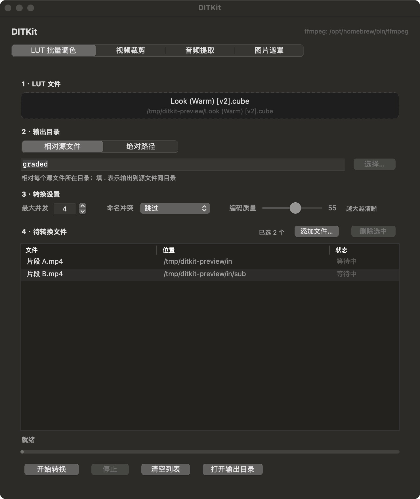
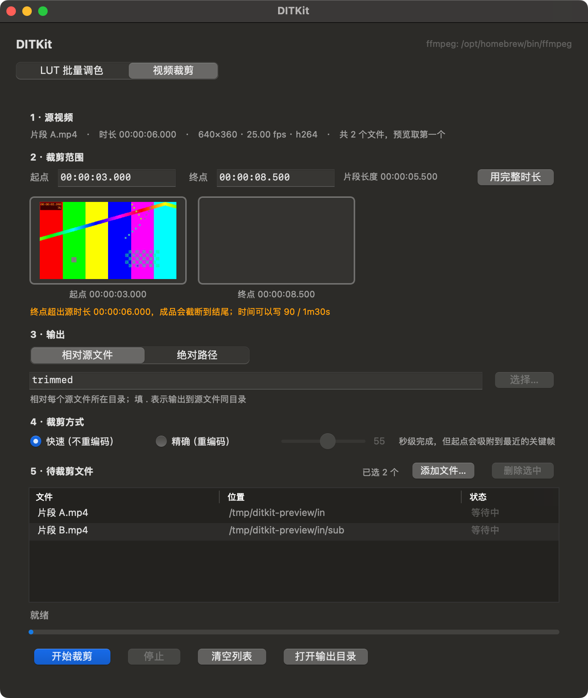

# DITKit

macOS 上的视频工具箱。原生 AppKit 界面 + 同一套逻辑的命令行模式，底层全部交给 `ffmpeg`。

目前有两个工具页：

| 工具页 | 做什么 |
|---|---|
| **LUT 批量套用** | 把同一个 `.cube` / `.3dl` / `.dat` / `.m3d` 套到任意数量的视频上，10-bit HEVC 硬编输出 |
| **视频裁剪** | 按时间码剪出指定区间；可选「快速流复制」或「精确重编码」，带起止帧预览 |





> 界面同时支持深色与浅色外观，跟随系统。

---

## 环境要求

- **macOS 15 或更高**（这是当前构建脚本产物的部署目标。`swiftc` 默认拿本机系统版本当部署目标，想支持更老的系统见下面「构建」一节）
- **Xcode Command Line Tools**（只需要里面的 `swiftc`，**不需要装 Xcode**）
- **ffmpeg**
  ```bash
  brew install ffmpeg
  ```
  App 会依次在 `$PATH`、`/opt/homebrew/bin`、`/usr/local/bin`、`/usr/bin`、`/bin` 以及 App 包内的 `Resources/` 里找 `ffmpeg` 和 `ffprobe`。找不到时启动界面上会显红字提示。

## 构建

```bash
git clone https://github.com/ZhiruiLi/dit-kit.git
cd dit-kit
./build.sh
```

产物是 `build/DITKit.app`（约 420 KB），**双击即可运行**。`build.sh` 会顺手做一次 ad-hoc 临时签名，避免 Gatekeeper 拦。

源码里没有 Xcode 工程文件、没有依赖管理，`build.sh` 直接调 `swiftc` 把 `DITKit/*.swift` 一次编完：

```
swiftc -swift-version 5 -O -whole-module-optimization \
  -framework Cocoa -framework UniformTypeIdentifiers -o ...
```

因为用的是通配符收集源文件，**加一个新工具页不用改构建脚本**。

**为什么锁在 `-swift-version 5`？** Swift 6 的严格并发检查会要求把整套 `Process` + `DispatchQueue` + 回调改写成 `async/await`，并给跨线程共享的状态标 `Sendable` —— 那是另一场重构（重做并发模型），和「用什么语言写」是两件事，真要做得单独开一版。现在这套代码在 Swift 5 语言模式下编得干净（零错误零警告）。

想支持比 15 更老的系统，给 `swiftc` 显式指定目标即可（已实测能编过，产物 `minos` 为 `12.0`）：

```
swiftc -swift-version 5 -O -target "$(uname -m)-apple-macos12.0" ...
```

分层与语言无关：`DITEngine` 不认任何具体工具、工具页之间只通过 `DITToolPage` 协议耦合。这套分层当初就是按「将来换实现可以逐层替换」设计的，这次从 Objective-C 换成 Swift 正好把这条路走了一遍 —— `Engine` → 共享 UI → 两个页面 → 入口，每换一层跑一次套件；结果是 68 条用例全绿，自检诊断输出与旧版**逐字节相同**（10 组场景交叉比对，含列表增删、列宽拖动、LUT 后缀校验）。

---

## 图形界面

两个工具页共用同样的操作流程：

1. **拖入素材** —— 直接拖到下方的**待处理列表**上（拖放区和列表是同一块区域）。可以拖视频文件，也可以整个文件夹拖进去（递归扫描子目录）；不想拖就点列表右上角的「添加文件…」
2. **设定输出位置** —— 绝对目录，或「源文件旁边的子目录」
3. **调参数** —— 最大并发（默认 4）、命名冲突策略、编码质量
4. **点「开始」**

列表本身是个正常的表：**三列的列宽都能拖**（拖过之后就按你拖的来，不会再被窗口缩放重置回去），选中一行或多行后点「删除选中」或直接按 <kbd>Delete</kbd> 就能把它们移出列表 —— 只动列表，磁盘上的文件不受影响。运行中每行会显示实时百分比进度，底部有总进度条和「停止 / 清空 / 在访达中显示」按钮。已生成过的产物（带输出后缀的文件）会被自动跳过，重复拖入同一文件也会去重。

LUT 页的调色文件拖放框会**按扩展名把关**：只收 `.cube` / `.3dl` / `.dat` / `.m3d`。拖错文件时它不会亮起、不会收下，状态行会写清楚「`xxx.mp4` 不是 LUT 文件，只接受 …」—— 免得把视频误当成调色文件拖进去，界面上却一声不响。

设置会记住（存在 `~/Library/Preferences/local.tools.ditkit.plist`）。

---

## 命令行

App 二进制本身就是 CLI，用 `--cli` 进入：

```bash
DITKit=./build/DITKit.app/Contents/MacOS/DITKit
```

### 批量套 LUT

```bash
"$DITKit" --cli --lut <LUT文件> [选项] -- <视频...>
```

| 选项 | 说明 | 默认 |
|---|---|---|
| `--out <绝对目录>` | 输出到指定目录 | — |
| `--relative <子目录>` | 输出到每个源文件所在目录的子目录 | `graded` |
| `--jobs <N>` | 最大并发数 | `4` |
| `--conflict <skip\|overwrite\|rename>` | 命名冲突策略 | `skip` |
| `--quality <10-90>` | 编码质量，**数值越大画质越高** | `55` |
| `--suffix <后缀>` | 输出文件名后缀 | `_graded` |

```bash
# 整目录递归处理，并发 2，输出到固定目录
"$DITKit" --cli --lut ~/LUTs/SLog3_to_709.cube \
  --out ~/Movies/graded --jobs 2 -- ~/Movies/raw

# 每个源文件旁边生成 graded/ 子目录
"$DITKit" --cli --lut ~/LUTs/Warm.cube --relative graded -- a.mp4 sub/b.mp4
```

### 裁剪片段

```bash
"$DITKit" --cli --trim --start <起点> --end <终点> [选项] -- <视频...>
```

| 选项 | 说明 | 默认 |
|---|---|---|
| `--start <时间>` | 片段起点 | `00:00:00.000` |
| `--end <时间>` | 片段终点（**必填**） | — |
| `--fast` | 快速流复制，几乎是瞬时；**起点会吸附到最近的关键帧** | ✅ 默认 |
| `--exact` | 精确重编码，切点准确到帧 | — |
| `--quality <10-90>` | `--exact` 模式下的编码质量 | `55` |
| `--out <绝对目录>` | 输出到指定目录 | — |
| `--relative <子目录>` | 输出到每个源文件所在目录的子目录 | `trimmed` |
| `--jobs <N>` | 最大并发数 | `4` |
| `--conflict <skip\|overwrite\|rename>` | 命名冲突策略 | `skip` |
| `--suffix <后缀>` | 输出文件名后缀 | `_trim` |

**时间码写法**（下面这些都能用）：

```
00:01:30.500    时:分:秒.毫秒
01:30           分:秒
90              纯秒数
90s  / 1m30s / 1h30m
```

```bash
# 剪 10s~30s，快速流复制，批量处理
"$DITKit" --cli --trim --start 10 --end 30 --fast --out ~/out -- *.mp4

# 剪 1m30s~2m，精确重编码，高质量
"$DITKit" --cli --trim --start 1m30s --end 2m --exact --quality 75 --out ~/out -- clip.mov
```

### 退出码

| 码 | 含义 |
|---|---|
| `0` | 全部成功（含被跳过、未覆盖的） |
| `1` | 有任务失败，或引擎起不来（例如找不到 ffmpeg） |
| `2` | 参数/用法错误，或没找到可处理的视频文件 |

`--help` 打印完整用法。

---

## 项目结构

```
dit-kit/
├── DITKit/                 源码
│   ├── main.swift          入口：窗口骨架（标题 / ffmpeg 状态 / 工具页切换），以及 --cli 分发
│   ├── DITUI.swift         共享 UI 零件：拖放区、任务表格、操作栏、布局容器、工具页协议
│   ├── Engine.swift        与工具无关的调度引擎：并发、进度解析、冲突策略、工具查找、时间码解析
│   ├── PageLUT.swift       LUT 批量套用页（GUI + CLI）
│   ├── PageTrim.swift      视频裁剪页（GUI + CLI）
│   └── Info.plist
├── tests/                  测试套件（见 tests/README.md）
│   ├── run.sh              入口
│   ├── lib.sh              断言库
│   ├── mkfixtures.sh       合成测试素材
│   ├── helpers/probe.py    像素探针
│   └── cases/*.sh          6 组用例，共 68 条
├── apply-lut.sh            独立的纯 shell 批量套 LUT 脚本，不依赖 App
├── build.sh                编译打包
├── render-preview.sh       渲染 preview/ 下的界面截图（素材自己合成，不依赖本地文件）
└── preview/                界面截图
```

### 设计要点

- **GUI 与 CLI 共用同一份 ffmpeg 参数构造代码。** 每个页面把参数生成抽成一个纯函数（`DITLUTArguments()` / `DITTrimArguments()`），GUI 和 `--cli` 都调它，所以两条路径的行为不会漂移。
- **`main.swift` 只负责窗口骨架。** 所有工具页都常驻在页容器里，切换时用 `hidden` 显隐 —— 这样切页不会丢掉各自已拖入的素材和参数。
- **`DITEngine` 不认识任何具体工具。** 它靠一个 `DITArgsBuilder` 闭包拿到 ffmpeg 参数，另外可选地提供 `preflight`（前置校验）和 `expectedDuration`（预期输出时长，用于算进度 —— 裁剪页就是靠它把进度基准从「源时长」换成「片段时长」）。

### 加一个新工具页

1. 写一个 `PageXxx.swift`，实现 `DITToolPage` 协议，提供 `view`、`pageTitle`、`layoutInBounds(_:)`、`busy`；
2. 在 `main.swift` 的 `pages` 数组里挂上 `PageXxx()`；
3. 如果需要在 `--cli` 下也能用，再加一个 `static func runCLI(_:)` 和 `static var cliUsage`，并在 `RunCLI()` 里分发。

构建脚本不用动。

---

## 测试

```bash
./tests/run.sh                     # 跑全部（首次会自动合成素材）
./tests/run.sh --filter 裁剪        # 只跑某一组
./tests/run.sh --list              # 列出全部用例
```

输出是 TAP 风格的 `ok` / `not ok`，退出码 0 才算全过。68 条用例覆盖命令行接口、时间码解析、LUT 套用与冲突策略、裁剪精度、引擎停止收尾、界面渲染与列表交互。

**测试素材完全由 `ffmpeg -f lavfi` 合成**，不依赖任何外部文件，换一台机器能跑出一模一样的结果。核心是一条「时间码标尺」视频：每 0.5 秒一种固定纯色、关键帧严格落在整秒 —— 于是「裁剪起点对不对」可以变成一条精确断言，而不是靠肉眼看。同理，LUT 测试用的是**精确交换 R/B 通道**的线性 cube，「输入 (R,G,B) 必须得到 (B,G,R)」是硬条件，比「颜色变了没」强得多。

界面用例靠自检模式截图，优先走窗口合成、拿不到时自动退回视图缓存，所以不依赖录屏权限。

细节（怎么加用例、可用的断言、每组覆盖了什么）见 **[tests/README.md](tests/README.md)**。

---

## apply-lut.sh

不想用 App 的纯命令行替代方案，只有 shell + ffmpeg：

```bash
mkdir -p input output
cp ~/LUTs/Look.cube ./look.cube
cp <你的视频> input/
bash apply-lut.sh
```

用环境变量调参：

```bash
LUT=./SLog3_to_709.cube bash apply-lut.sh          # 指定 LUT
INDIR=~/Movies/log OUTDIR=~/Movies/graded bash apply-lut.sh
JOBS=3 bash apply-lut.sh                           # 并行 3 个文件
VQ=65 bash apply-lut.sh                            # 画质拉高
OVERWRITE=1 bash apply-lut.sh                      # 覆盖已有输出
# HDR(HLG/PQ) 素材先转 SDR 再套 LUT：
VF_PRE='zscale=t=linear:npl=100,tonemap=hable:desat=0,zscale=p=bt709:t=bt709:m=bt709' bash apply-lut.sh
```

它支持 `.cube / .3dl / .dat / .m3d`，递归扫描子目录并保持相对目录结构，输出的像素格式是 `p010le`（10-bit，抑制调色后的断层）。

---

## 已知限制

- **不内置 ffmpeg**，必须自己装。App 只是调度它。
- **只处理这些扩展名**：`mp4` `mov` `m4v` `mkv` `avi` `mxf` `mp4v` `hevc` `ts`（大小写不敏感）。
- **`--fast` 的切点受关键帧限制**。流复制不解码画面，起点只能落在最近的关键帧上，所以实际片段可能比请求的略长或略短。要精确到帧就用 `--exact`。
- **视频编码默认走 VideoToolbox 硬编**（`hevc_videotoolbox`）。Apple Silicon 上最快；Intel Mac 上取决于该机型 GPU 的 VideoToolbox 支持情况。
- **仅限 macOS**，用了 AppKit。
- 裁剪的 `--exact` 模式音频会重编码为 AAC 192k（切点通常不落在音频帧边界上，必须重编才能对齐）；`--fast` 模式则原样复制音频。
- **点「停止」时正在跑的那个任务会留下一个残片**。ffmpeg 收到 SIGTERM 是优雅退出、会把容器写完，所以这个残片是**可播放的**（不是坏文件）。但它带输出后缀，下次同一批再跑时 `--conflict skip` 会把它当成已完成而跳过 —— 有拿残片当成品用的风险。
- **路径里含隐藏目录的输入会被跳过**，和隐藏文件一样。这是有意的（避免扫到 `.Trash`、`.git` 之类），但如果你的素材放在某个以 `.` 开头的目录下，需要先搬出来。
- **已知问题：起止完全落在源时长之外时，会产出空容器却报告成功。** `--exact --start 60 --end 90` 作用在 10 秒的源上，会生成一个约 257 字节、不含任何有效媒体的 mp4，而汇总行照样写「失败 0」。测试套件里有一条用例专门锁定这个行为（`裁剪 · 已知问题：空产物被报成完成`），修好后它会变红提醒。绕开办法：别让范围整体越过源尾。

## License

[MIT](LICENSE)
